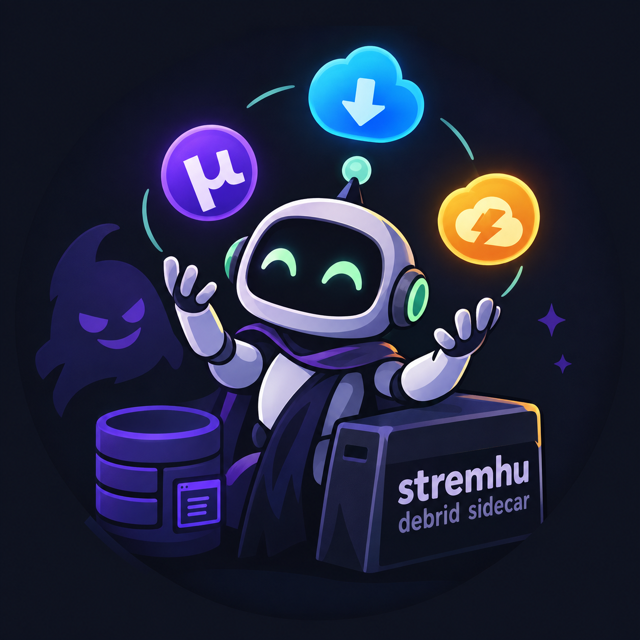
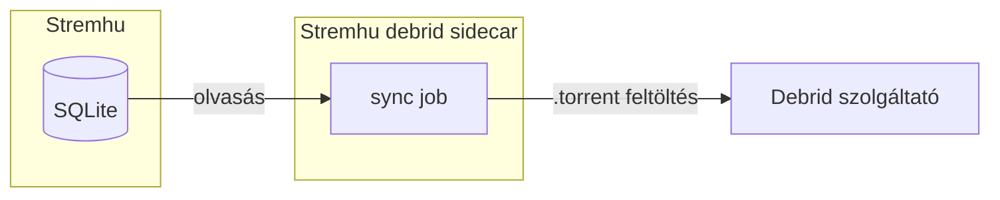

<div align="center">



# Stremhu debrid sidecar

A Stremhu debrid sidecar figyeli, mit játszottál le [Stremhu](https://github.com/s4pp1/Stremhu-source)-val, és feltölti
a debrid szolgáltatódhoz, hogy az legközelebb már cache-ből indulhasson. Emellett akár megoszthatod a debrid könyvtárat tartalmát a közösséggel is.

[](https://github.com/peterdeme/Stremhu-debrid-sidecar/actions/workflows/ci.yaml)
[](https://github.com/peterdeme/Stremhu-debrid-sidecar/actions/workflows/lint.yaml)
[](https://www.python.org)
[](LICENSE)

</div>

---

## ✨ Mit csinál

- **Debrid szolgáltatóhoz feltöltés.** A Stremhuval lejátszott torrentek felkerülnek a debrid fiókodba, így azt mások is tudják hasznosítani.
- **Season pack-eknél a legjobb.** Az első epizódot még Stremhuból nézed, a másodikat már akár cache-ből is.
- **Közösségi megosztás (opcionális).** A debrid fiókodban cache-elt hash-eket közzéteszi a Debrid Media Managerben, hogy másoknak is elérhetővé váljanak.

## 🔄 Debrid szinkronizációs job



A Stremhu debrid sidecar bizonyos időközönként beleolvas a Stremhu SQLite adatbázisába, és feltölti az ott talált torrenteket a debrid szolgáltatódhoz.

> Be lehet állítani, hogy milyen feltételek teljesülésekor történjen meg a feltöltés. Például ha csak pár másodpercet játszottál egy torrentből, akkor a feltöltés elkerülhető.

## 🌍 Közösség felé szinkronizáló job (opcionális)


A `dmm` adatbázist többek közt a Zilean és a Comet is olvassa, így mindenki számára elérhetővé válik.

## 🏁 Elindítás

```yaml
services:
  stremhu-source:
    image: s4pp1/stremhu-source:latest
    ports:
      - "6881:6881"
    volumes:
      - ./stremhu-data:/app/data

  stremhu-debrid-sidecar:
    image: ghcr.io/peterdeme/stremhu-debrid-sidecar:latest
    ports:
      - "127.0.0.1:8000:8000"
    volumes:
      - ./sidecar-data:/data
      - ./stremhu-data/system/database:/stremhu/system/database
      - ./stremhu-data/downloads:/stremhu/downloads:ro
```

Ezután nyisd meg a `http://localhost:8000` címet, és add meg a debrid API kulcsodat. A belépési
jelszót az első indításkor generáljuk és kiírjuk a logba (`docker compose logs`), vagy megadhatod
az `ADMIN_PASSWORD` környezeti változóval is.

> [!WARNING]
> A port szándékosan a `127.0.0.1` címre van kötve: a webes felület csak a beállításokhoz kell,
> az ütemezett feladatok attól függetlenül futnak, hogy eléri-e valaki. Ne tedd ki az internetre.
> Ha végeztél a beállítással, a `ports` blokk akár teljesen el is hagyható, a sidecar ugyanúgy
> működik tovább.


## 🛠 Fejlesztés

```sh
python -m venv .venv && .venv/bin/pip install -e .
.venv/bin/uvicorn app.main:app --reload
```

## ⚖️ Jogi nyilatkozat

Ez az eszköz nem keres, nem indexel és nem szolgáltat tartalmat. Kizárólag azokat a
torrenteket mozgatja a saját debrid fiókodba, amelyeket a Stremhuval már lejátszottál,
a saját gépeden, a saját fiókjaiddal, a saját trackereiddel.

Azért, hogy mit töltesz le és mit teszel közzé, te felelsz. A szerzői jogi szabályok
országonként eltérnek, a privát trackerek szabályzata pedig külön köt. **Szerzői joggal védett
tartalom jogosulatlan letöltését vagy terjesztését a projekt nem támogatja.**

---

<div align="center">
<a href="LICENSE">AGPL-3.0 licenc</a>. A projekt nem áll kapcsolatban semmilyen trackerrel, a Stremhuval, debrid szolgáltatókkal és a Debrid Media Managerrel sem.
</div>
