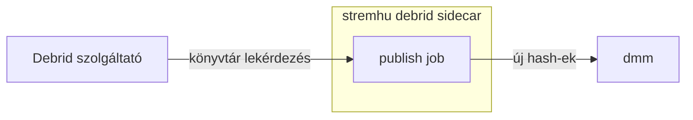

# stremhu debrid sidecar

A stremhu-debrid-sidecar szorosan a [stremhu-source](https://github.com/s4pp1/stremhu-source)-ra épül, és kettő háttérfolyamatot futtat:
- a Stremhu által már letöltött torrenteket feltölti egy debrid szolgáltatóhoz, így legközelebbi lejátszáskor az már cache-ből történhet. Ez különösen hasznos season pack-eknél, ahol az első epizódot ugyan még Stremhu-ból játszod le, a második már cache-ből is tud érkezni.
- opcionálisan, a debrid-en cachelt torrenteket közzé is tudja tenni, hogy mások is elérhessék

A Stremhu adatbázisát kell felcsatolni Docker volume-ként, így abból közvetlen kiolvasva látja a nemrég lejátszott médiát.

## Debrid szinkronizációs job


## Közösség felé szinkronizáló job



A `dmm` adatbázist pedig többek közt a Zilean és a Comet is olvassa, így mindenki számára elérhetővé válik.

## Elindítás

```yaml
services:
  stremhu-source:
    image: s4pp1/stremhu-source:latest
    ports:
      - "6881:6881"
    volumes:
      - ./stremhu-data:/app/data

  stremhu-debrid-sidecar:
    image: ghcr.io/peterdeme/stremhu-debrid-sidecar:latest
    ports:
      - "127.0.0.1:8000:8000"
    volumes:
      - ./sidecar-data:/data
      - ./stremhu-data/system/database:/stremhu/system/database
      - ./stremhu-data/downloads:/stremhu/downloads:ro
```

Ezután nyisd meg a `http://localhost:8000` címet, és add meg a debrid API kulcsodat. A belépési
jelszót az első indításkor generáljuk és kiírjuk a logba (`docker compose logs`), vagy megadhatod
az `ADMIN_PASSWORD` környezeti változóval is.

> A port szándékosan a `127.0.0.1` címre van kötve: a webes felület csak a beállításokhoz kell,
az ütemezett feladatok attól függetlenül futnak, hogy eléri-e valaki. Ne tedd ki az internetre.
Ha végeztél a beállítással, a `ports` blokk akár teljesen el is hagyható, a sidecar ugyanúgy
működik tovább.


## Fejlesztés

```sh
python -m venv .venv && .venv/bin/pip install -e .
.venv/bin/uvicorn app.main:app --reload
```

A konténer a stremhu időzónáját várja, mert a stremhu naiv, helyi idejű időbélyegeket ír.
Ha a két konténer időzónája eltér, a szinkronizációs ablak elcsúszhat.

## Jogi nyilatkozat

Ez az eszköz nem keres, nem indexel és nem szolgáltat tartalmat. Kizárólag azokat a
torrenteket mozgatja a saját debrid fiókodba, amelyeket a stremhuval már lejátszottál,
a saját gépeden, a saját fiókjaiddal, a saját trackereiddel.

Azért, hogy mit töltesz le és mit teszel közzé, te felelsz. A szerzői jogi szabályok
országonként eltérnek, a privát trackerek szabályzata pedig külön köt. **Szerzői joggal védett
tartalom jogosulatlan letöltését vagy terjesztését a projekt nem támogatja.**

A projekt nem áll kapcsolatban semmilyen tracker-rel, stremhuval, debrid szolgáltatóval és a Debrid Media Manager-rel sem.

## Licenc

AGPL-3.0
